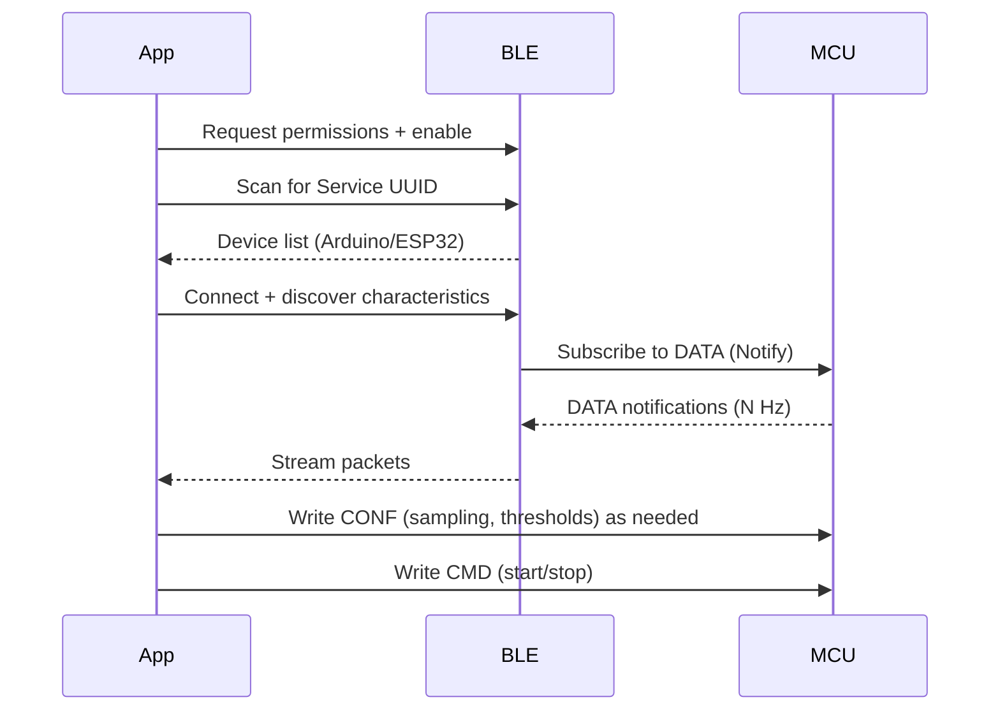

# Cue Breaker – Hardware & Software Architecture

This document outlines a practical Arduino-based hardware prototype and the software architecture for the Cue Breaker mobile app. Diagrams use Mermaid so they render as graphs in GitHub.

## Overview
- Goal: Sense “cues” from the environment or user, detect patterns, and present coaching/feedback on the Android app.
- Hardware: Small, wearable or desktop sensor node with BLE connectivity to the app.
- Firmware: Reads sensors at fixed intervals, processes basic features, publishes data over BLE, accepts commands.
- App: Capacitor/Vite React app, connects via BLE, visualizes data, applies simple rules, syncs preferences.

## Hardware Architecture

```mermaid
flowchart TD
    Power[Battery/5V USB] -- 3.3V/5V Reg --> MCU
    MCU[Arduino (Nano 33 BLE / ESP32)]
    subgraph Sensors
      IMU[IMU (Accel/Gyro)]
      FSR[Force Sensor]
      ENV[Ambient Light/Temp]
      BTN[Push Button]
    end
    BLE[(BLE Radio)]
    LED[Status LED]
    Phone[Android App]

    Power --> MCU
    MCU <--> IMU
    MCU <--> FSR
    MCU <--> ENV
    MCU --> LED
    MCU <--> BLE
    BLE --- Phone
```

Recommended MCU options:
- Arduino Nano 33 BLE (or BLE Sense) – built‑in BLE, onboard IMU and sensors.
- Alternative: ESP32 DevKit – BLE + Wi‑Fi onboard; use external sensors.
- Fallback (classic Arduino): Arduino UNO + HM‑10 BLE module + external sensors (limits BLE features).

Bill of Materials (example):
- 1× Arduino Nano 33 BLE Sense
- 1× FSR (Force Sensitive Resistor) or capacitive touch sensor
- Optional: External light sensor (e.g., TEMT6000), temp/ humidity (SHT31)
- 1× LiPo battery + boost/charger (TP4056) or 5V USB power
- 1× LED + 220Ω resistor, 1× Push button
- Breadboard/jumper wires or small PCB

## Firmware Architecture

```mermaid
flowchart LR
    entry[setup()/loop()] --> sm[SensorManager]
    entry --> ble[BLEService]
    sm --> feat[FeatureExtractor]
    feat --> ble
    ble --> cmd[CommandHandler]

    subgraph BLE Characteristics
      DATA[(Notify: sensor/features stream)]
      CMD[(Write: commands)]
      CONF[(Write: config/profile)]
    end
    ble <--> DATA
    ble <--> CMD
    ble <--> CONF
```

Core responsibilities:
- SensorManager: Reads IMU/FSR/ENV at N Hz, debounces BTN.
- FeatureExtractor: Computes simple features (mean/variance, motion magnitude, pressure peaks).
- BLEService: Advertises a custom service; notifies DATA at a fixed interval; receives CMD/CONF.
- CommandHandler: Applies config (sampling rate, thresholds), handles start/stop, LED feedback.

Suggested BLE UUIDs (example):
- Service: `6a40c120-01c6-4f4f-bcc6-0f2a6f4b9f01`
- DATA characteristic (Notify): `6a40c121-01c6-4f4f-bcc6-0f2a6f4b9f02`
- CMD characteristic (Write): `6a40c122-01c6-4f4f-bcc6-0f2a6f4b9f03`
- CONF characteristic (Write): `6a40c123-01c6-4f4f-bcc6-0f2a6f4b9f04`

Data packet schema (compact JSON or CBOR for prototype):
```json
{
  "ts": 1712345678,
  "imu": {"ax":0.01,"ay":-0.02,"az":0.98,"gx":0.5,"gy":-0.1,"gz":0.0},
  "fsr": 112,
  "env": {"lux": 45, "temp": 23.4},
  "feat": {"motion": 0.12, "pressure_peak": false}
}
```

## Mobile App Architecture (Capacitor + React + Vite)

```mermaid
flowchart TD
    UI[Pages/Components]
    BLEC[BLE Client (Capacitor BLE plugin)]
    VM[State/Store]
    DL[Data Layer]
    Rules[Rules Engine]
    Store[Local Storage]

    UI <--> VM
    VM <--> BLEC
    BLEC <--> DL
    DL --> Store
    DL --> UI
    DL --> Rules
    Rules --> UI
```

Key app modules:
- BLE Client: Uses Capacitor community plugin `@capacitor-community/bluetooth-le` to scan/connect/subscribe.
- Data Layer: Parses packets, buffers, persists sessions, exposes selectors.
- Rules Engine: Simple thresholds/state machine to detect “cue” events and drive coaching prompts.
- UI: Connection screen, live telemetry, history, settings.

## Connection & Streaming Sequence



## Minimal Firmware Sketch (Arduino Nano 33 BLE Sense)

```cpp
// Pseudocode sketch outline
#include <ArduinoBLE.h>

BLEService svc("6a40c120-01c6-4f4f-bcc6-0f2a6f4b9f01");
BLECharacteristic dataChar("6a40c121-01c6-4f4f-bcc6-0f2a6f4b9f02", BLERead | BLENotify, 128);
BLECharacteristic cmdChar("6a40c122-01c6-4f4f-bcc6-0f2a6f4b9f03", BLEWrite, 64);
BLECharacteristic confChar("6a40c123-01c6-4f4f-bcc6-0f2a6f4b9f04", BLEWrite, 64);

void setup() {
  BLE.begin();
  BLE.setLocalName("CueBreaker");
  BLE.setAdvertisedService(svc);
  svc.addCharacteristic(dataChar);
  svc.addCharacteristic(cmdChar);
  svc.addCharacteristic(confChar);
  BLE.addService(svc);
  BLE.advertise();
}

void loop() {
  BLEDevice central = BLE.central();
  if (central) {
    while (central.connected()) {
      // Read sensors, compute features
      // Serialize as JSON into a buffer
      // dataChar.setValue(buffer, len); // notify
      delay(50);
    }
  }
}
```

## App Integration Notes
- Capacitor plugin: `@capacitor-community/bluetooth-le` for cross‑platform BLE; on Android require location/BLE permissions.
- Sampling/stream rate: start at 10–20 Hz to limit bandwidth; use feature summaries (e.g., 1 Hz) for UI.
- Offline mode: if `server.url` is removed from `capacitor.config.ts`, the app serves `dist/` assets.

## Next Steps
- Build POC firmware that streams IMU magnitude + FSR value.
- Add BLE connect UI and live telemetry view in the app.
- Implement basic “cue” detection rule and user feedback.
- Iterate on sensor choice and enclosure based on UX testing.